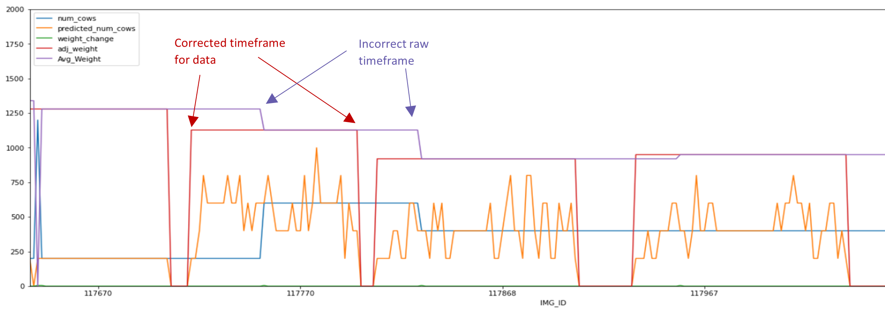

# Development

The development follows an agile approach. Iterative development is performed for each module as well as for the entire 
pipeline. A level of effectiveness is desired before formalizing and documenting the code. 
Development roughly followed the following procedure: 

1. List the desired outcomes 
2. Experiment with the data and code in jupyter notebooks 
3. Create prototype solutions that achieve the desired results
4. Revise the desired outcomes and the processes for achieving them
5. Reiterate the process

The most basic functional product was pushed to the public server as early as possible. After seeing results and revising
the desired outcomes, the process was reiterated to revise functionality, improve models, and solidify code into a more
robust system. 

### Contents
The project is divided into five major modules. The development of these modules will be discussed in more detail in the 
following sections. 

1. [Collect](#collect) 
2. [Clean](#clean)
3. [Train](#train)
4. [Evaluate](#evaluate)
5. [Deploy](#deploy)

## Collect

## Clean
One of the most important aspects of machine learning is data cleaning. Careful consideration must be made for what makes
clean data and how the data can be cleaned automatically without loosing, or worse, corrupting portions of the data. 

### Fill Missing Data
On the first iteration of data collection, not all the information was collected. One example is the timestamp.
This vital piece of information was left out of the first two weeks of data. Rather than letting this data go to waste, 
a solution was developed into the cleaning procedure to fill any missing timestamps with the 'modified' property of the
corresponding image file. Another piece of data that is filled to update older data versions is the lot number. 
This identifies images that are of the same cow. To retroactively fill this data, the number is given according to the 
uniqueness of other data. 

### Fixing Numerical Data
Numerical data included commas in the thousands place, units that had to be removed from the string, and ranges that
had to be discarded. 

### Correcting the Data Timing
Much of the data comes from live data in which there is a severe lack of quality. 
One of the biggest challenges in cleaning this data is the timing of information. When the auction is live, each lot has
information that is taken from a queue and placed in the viewing screen manually by a human that is present when the cattle
are in view of the camera. Often times the cows are allowed into view before the data is switched. 
Sometimes the cows are let in after the data is switched. Occasionally, a lot's information did not get put in the 
queue and thus stays incorrect for the duration of the viewing for the cattle lot. Sometimes these lots will have the
information entered manually during the viewing. This means the information is significantly delayed compared to the 
image view.

The following criteria is used to define the most accurate information for a group of cows in the arena:
 1.	A group of points in a dataset is accepted as a valid lot if it contains at least 4 consecutive images with predicted cows. And there are at least two consecutive points with no cows between them.
 2.	The correct weight associated with the entire lot is the new weight after the last weight change during the time of the valid lot.
 3.	If the valid lot has no weight change for the duration of cows present in the image, and there is a weight change present before the valid lot (while there are no detected cows in image), then valid weight will be the weight at the start of the valid lot.
 4.	If there are multiple valid lots separated by only one image with no cows detected, combine the valid lots.

Based on the criteria, I was able to make an algorithm that adjusted the timing of the data to match the timing of the 
images. The following diagram shows the updated weight information (in red) In correct timing with the number of cows 
predicted in the image (yellow). This can be compared with the raw weight information (purple).

### Extracting Useful Data
It is difficult to obtain a weight estimate with multiple cows in an image. Also, to use single cows cropped out of a 
multi-cow image would only add variance to the data since the average weight of the group would be applied to the 
selected cow. To simplify the task, only the single cows lots were chosen for training on. This reduced the volume of 
usable data significantly, but it was a necessary cost for data quality. 

### Distribution of Validated Data
After getting a valid set of data, we need to look at the distribution to see where our data and therefore 
our model will be biased. The following shows a histogram of weight bins indicating the distribution across the 
validated data. 

The large amount of 0 weight data is single-cow data that was not able to be validated by the timing adjustment algorithm.
We get rid of this data as well as the limited data on the tails of the distribution to reduce bias in the model. 
The final training distribution is as follows:

## Train
Training is implemented for automated model testing. The training script trains any model placed in the built models folder of the database.
Parameters for training are set in a .json configuration file. This allows for the fast iterative approach that is necessary for machine learning.

Regression is performed on the models with a single weight value in pounds as the output. The pound is used since this is the 
commonly used unit in the cattle industry.

For the loss function a commonly used mean squared error is used: $$ MSE = \frac {\sum \limits _{i=0} ^{N}  (y - \hat{y})^2} {N} $$ 

During training, the model parameters are embedded into  the name of the model. With this method, each version of the
model can easily be identified in tensorboard. 
For the evaluation process, these embeddings can be decoded and compared. 

The training process was developed as more images were being collected. As more data was collected, the process is repeated 
with the new data. An experiment was performed to view the trend in increased performance versus the amount of data collected.
The details and results of that expiriment can be found in the [scaling notebook.](../notebooks/4_scaling.ipynb) 

### The Data
Training begins with the cleaned dataset and utilizes it for three main operations. 
1. Training
2. Validation 
3. Evaluation

Splitting the data into these three sets is an extremely important step in the training process. It is necessary that we use part of the dataset for 
validation that has not been seen by the network during training. In addition to this split, we perform another 
split to reserve a portion of the data for evaluation of our models once the training has completed. We want to evaluate how the 
model performs on new cows that go through the auction. Since the training and testing data is selected at random from the datset, 
and the data has multiple images of each cow, it is possible that some pictures of the same cow are in the training set as well 
as the testing set. To achieve a more reliable evaluation of our models, we will use data that has been recently added 
to the dataset. This way the entire evaluation set will be new cows.

### Models
Most of the models used are common models initialized with pre-trained weights. The transfer learning approach is used to 
adapt these pre-trained models to the cattle weight dataset. The idea is that some knowledge obtained by those models 
in other domains can be utilized in this domain. 
Multiple iterations of the training process were performed for the following models:
1. Xception 
2. Inception
3. InceptionRes
4. Resnet152
5. Resnet50
6. A custom CNN
7. A Muti-Image CNN
8. Transformer
9. Vgg19

For more information on the training process and results, see the training [notebooks](../notebooks).

### Visualization
To better understand the training of the models and to visualize the attention of the models, the [keract](https://pypi.org/project/keract/)
library was used to look at the activations of the layers. Below are some examples taken from the training of the Xception network.

It is not easy to derive meaning or effectiveness from these activations. Some research [[3]](../README.md#references-and-related-works) 
has shown the chest width measurement to be the trait most related to the body weight. With "correct" training of the model, 
it would be expected that there would be more activation in the layers around the chest area. While this expectation is occasionally met, 
the more commonly observed trend is segmentation of the animal in early activation layers with a focus on the back in the
later layers. 

One notable observation is that in several of the images the heatmap has the cow’s shadow highlighted. 
It seems like it might be using the shadow of the cow for added perspective on the width of the animal! 

## Evaluate

### Metrics
The two main evaluation components that are evaluated are:

 1. Mean absolute error as an error metric: 
           
    $$ MAE =  \frac {\sum \limits _{i=0} ^{N} |y_i - \hat{y_i}|} {N} $$

 2. Mean absolute accuracy percentage as an accuracy metric:

    $$ MAAP = (1 -  {\sum \limits _{i=0} ^{N} \frac {|y_i - \hat{y_i}|} {\hat{y_i}}}) * 100 \% $$

MAE was chosen to give a fair representation by how many pounds the model misrepresented the image. This metric is often
used in machine learning and also has meaningful information for someone in the cattle industry.  
The accuracy metric gives a comparative value for anyone in any domain to easily recognize. The normalization in the
accuracy metric also provides us with an understanding of the relativity with which a model predicts. In essence, it is 
more sensitive toward lighter animals of which the accuracy is of greater importance. This is especially true as it relates 
to the health of the animal. 

Other metrics were added for extra insights: 
1. Mean Error

    This metric is included to observe the bias of the model. There is a greater amount of training data in the 500-700lb 
range. If a model is trained poorly, it could be "guessing" low on higher weight cows. This metric will catch that bias. 

2. Error STD

Helps us understand the distribution of the error. 
    
3. Minimum Error
4. Maximum Error
5. Maximum Absolute Error

These last three metrics are included to show us the extremes of the error for reliability purposes. 

### Results

 name | mean_abs_accuracy |mean_abs_error |   error_mean |   error_std |   error_min |   error_max | data_set  | max_abs_error | architecture | opt     
----:|:----------------------------------|--------------------:|-----------------:|-------------:|------------:|------------:|------------:|:-------------|----------------:|:---------------|:--------
  62 | iceptres_freeze_adagrad_194_9939  |             88.0444 |          83.58   |     -6.42346 |    108.462  |    -497.868 |     425.524 | hard                 923.392 | iceptres       | adagrad |
|  57 | iceptres_freeze_adagrad_172_11404 |             88.1085 |          80.8649 |      2.70067 |    104.936  |    -457.388 |     483.398 | easy         |         940.786 | iceptres       | adagrad |
|  61 | iceptres_freeze_adagrad_194_9939  |             90.7585 |          64.1277 |    -18.1107  |     82.8528 |    -367.898 |     378.778 | hand_cleaned |         746.676 | iceptres       | adagrad |
| 213 | incept_freeze_adagrad_241_11832   |             88.1029 |          81.6219 |     -4.04257 |    107.434  |    -456.223 |     427.787 | easy         |         884.01  | incept         | adagrad |
| 218 | incept_freeze_adagrad_282_11528   |             88.1699 |          82.9041 |      5.5039  |    109.001  |    -477.048 |     437.77  | hard         |         914.818 | incept         | adagrad |
| 220 | incept_freeze_adagrad_298_11182   |             91.2679 |          62.2784 |    -24.3674  |     79.689  |    -424.34  |     447.316 | hand_cleaned |         871.655 | incept         | adagrad |
| 237 | res152_adagrad_18_13996           |             69.9538 |         179.394  |   -101.816   |    193.812  |    -425.658 |     598.849 | easy         |        1024.51  | res152         | adagrad |
| 280 | res152_adagrad_45_10015           |             72.7807 |         188.802  |    -40.4565  |    225.333  |    -461.701 |     604.875 | hand_cleaned |        1066.58  | res152         | adagrad |
| 239 | res152_adagrad_18_13996           |             75.6832 |         154.932  |    -76.6069  |    179.763  |    -430.867 |     580.997 | hard         |        1011.86  | res152         | adagrad |
| 332 | vgg19_adagrad_221_12429           |             87.2185 |          91.1273 |      5.50042 |    117.399  |    -385.196 |     452.282 | hard         |         837.478 | vgg19          | adagrad |
| 330 | vgg19_adagrad_221_12429           |             88.032  |          80.571  |     -5.46873 |    102.879  |    -312.338 |     436.529 | easy         |         748.867 | vgg19          | adagrad |
| 331 | vgg19_adagrad_221_12429           |             89.076  |          80.0917 |     -9.75042 |    103.503  |    -393.223 |     439.389 | hand_cleaned |         832.612 | vgg19          | adagrad |
| 593 | xcept_freeze_adagrad_209_10666    |             89.0772 |          76.9288 |     -0.30418 |    100.753  |    -443.945 |     463.716 | hard         |         907.661 | xcept          | adagrad |
| 588 | xcept_freeze_adagrad_200_11047    |             89.1352 |          73.6268 |     -7.26301 |     94.8888 |    -365.463 |     483.342 | easy         |         848.805 | xcept          | adagrad |
| 589 | xcept_freeze_adagrad_200_11047    |             90.5295 |          67.478  |    -17.045   |     86.4519 |    -393.883 |     411.196 | hand_cleaned |         805.079 | xcept          | adagrad |

## Deploy
The [streamlit](https://streamlit.io/) library was chosen for a deployment app due to the intuitive
nature of the interface and compatibility with machine learning/data visualization.
Not only is the interface convenient for showcasing the project, but it's also useful for 
testing models and visualising data locally for iterative development. 

The web app was built in two with the following two main components: 

1. The Prediction Page was built to showcase the model and to retrieve extra data from users.
2. The Data Page was built to allow users to interact with the models and data.
