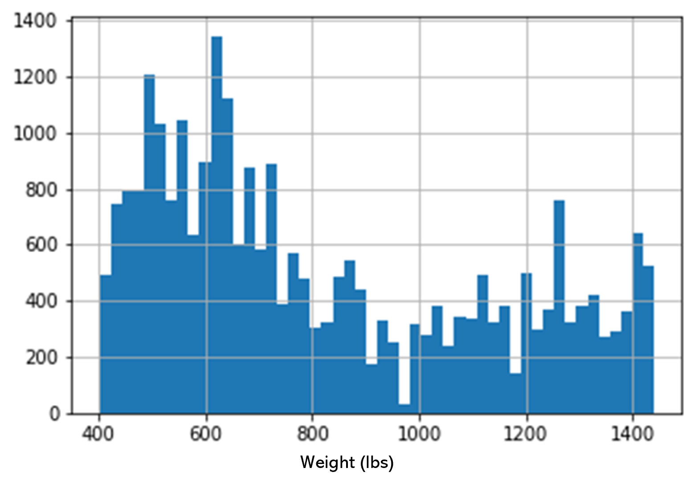

# Development

The development follows an agile approach. Iterative development is performed for each module as well as for the entire 
pipeline. A level of effectiveness is desired before formalizing and documenting the code. 

### Contents

1. [Collect](#collect) 
2. [Clean](#clean)
3. [Train](#train)
4. [Evaluate](#evaluate)
5. [Deploy](#deploy)

## Collect

## Clean

### Correcting the Data Timing
Much of the data comes from live data in which there is a severe lack of quality. 
One of the biggest challenges in this data is the timing of information. When the auction is live, each lot has
information that is taken from a queue and placed in the viewing screen manually by a human that is present at the auction.
Often times the cows are allowed into the ring before the data is switched. Sometimes the cows are let in after the
data is switched. Occasionally, a lot's information did not get put in the queue and thus stays incorrect for the
duration of the viewing for the cattle lot. Sometimes these lots will have the information entered manually during
the viewing. This means the information is significantly delayed compared to the image view.

The following criteria is used to define the most accurate information for a group of cows in the arena:
 1.	A group of points in a dataset is accepted as a valid lot if it contains at least 4 consecutive images with predicted cows. And there are at least two consecutive points with no cows between them.
 2.	The correct weight associated with the entire lot is the new weight after the last weight change during the time of the valid lot.
 3.	If the valid lot has no weight change for the duration of cows present in the image, and there is a weight change present before the valid lot (while there are no detected cows in image), then valid weight will be the weight at the start of the valid lot.
 4.	If there are multiple valid lots separated by only one image with no cows detected, combine the valid lots.

Based on the criteria, I was able to make an algorithm that adjusted the timing of the data to match the timing of the 
images. The following diagram shows the updated weight information (in red) In correct timing with the number of cows 
predicted in the image (yellow). This can be compared with the raw weight information (purple).

### Extracting Useful Data
It is difficult to obtain a weight estimate with multiple cows in an image. Also, to use single cows cropped out of a 
multi-cow image would only add variance to the data since the average weight of the group would be applied to the 
selected cow. To simplify the task, only the single cows lots were chosen for training on. This reduced the volume of 
usable data significantly, but it was a necessary cost for data quality. 

### Distribution of Validated Data
After getting a valid set of data, we need to look at the distribution to see where our data and therefore 
our model will be biased. The following shows a histogram of weight bins indicating the distribution across the 
validated data. 

The large amount of 0 weight data is single-cow data that was not able to be validated by the timing adjustment algorithm.
We get rid of this data as well as the limited data on the tails of the distribution to reduce bias in the model. 
The final training distribution is as follows:

## Train
Training is implemented for automated model testing. The training script trains any model placed in the built models folder of the database.
Parameters for training are set in a .json configuration file. This allows for the fast iterative approach that is necessary for machine learning.

Regression is performed on the models with a single weight value in pounds as the output. The pound is used since this is the 
commonly used unit in the cattle industry.

For the loss function a commonly used mean squared error is used: $$ \epsilon = \frac {\sum \limits _{i=0} ^{N}  (y - \hat{y})^2} {N} $$ 

### The Data
Training begins with the cleaned dataset and utilizes it for three main operations. 
1. Training
2. Validation 
3. Evaluation

Splitting the data into these three sets is an extremely important step in the training process. It is necessary that we use part of the dataset for 
validation that has not been seen by the network during training. In addition to this split, we perform another 
split to reserve a portion of the data for evaluation of our models once the training has completed. We want to evaluate how the 
model performs on new cows that go through the auction. Since the training and testing data is selected at random from the datset, 
and the data has multiple images of each cow, it is possible that some pictures of the same cow are in the training set as well 
as the testing set. To achieve a more reliable evaluation of our models, we will use data that has been recently added 
to the dataset. This way the entire evaluation set will be new cows.

### Models
Most of the models used are common models initialized with pre-trained weights. The transfer learning approach is used to 
adapt these pre-trained models to the cattle weight dataset. The idea is that some knowledge obtained by those models 
in other domains can be utilized in this domain. 

### Visualization
To better understand the training of the models and to visualize the attention of the models, the [keract](https://pypi.org/project/keract/)
library was used to look at the activations of the layers. Below are some examples taken from the training of the Xception network.

It is not easy to derive meaning or effectiveness from these activations. Some research [[3]](README.md#references-and-related-works) 
has shown the chest width measurement to be the trait most related to the body weight. With "correct" training of the model, 
it would be expected that there would be more activation in the layers around the chest area. While this expectation is occationally met, 
the more commonly observed trend is segmentation of the animal in early activation layers with a focus on the back in the
later layers. 

One notable observation is that in several of the images the heatmap has the cow’s shadow highlighted. 
It seems like it might be using the shadow of the cow for added perspective on the width of the animal! 

## Evaluate
The two main evaluation components that are evaluated are 

## Deploy
The [streamlit](https://streamlit.io/) library was chosen for a deployment app due to the intuitive
nature of the interface and compatibility with machine learning/data visualization.
Not only is the interface convenient for showcasing the project, but it's also useful for 
testing models and visualising data locally for iterative development. 

The web app was built in two with the following two main companents: 

1. The Prediction Page was built to showcase the model and to retireve extra data from users.
2. The Data Page was built to allow users to interact with the models and data.