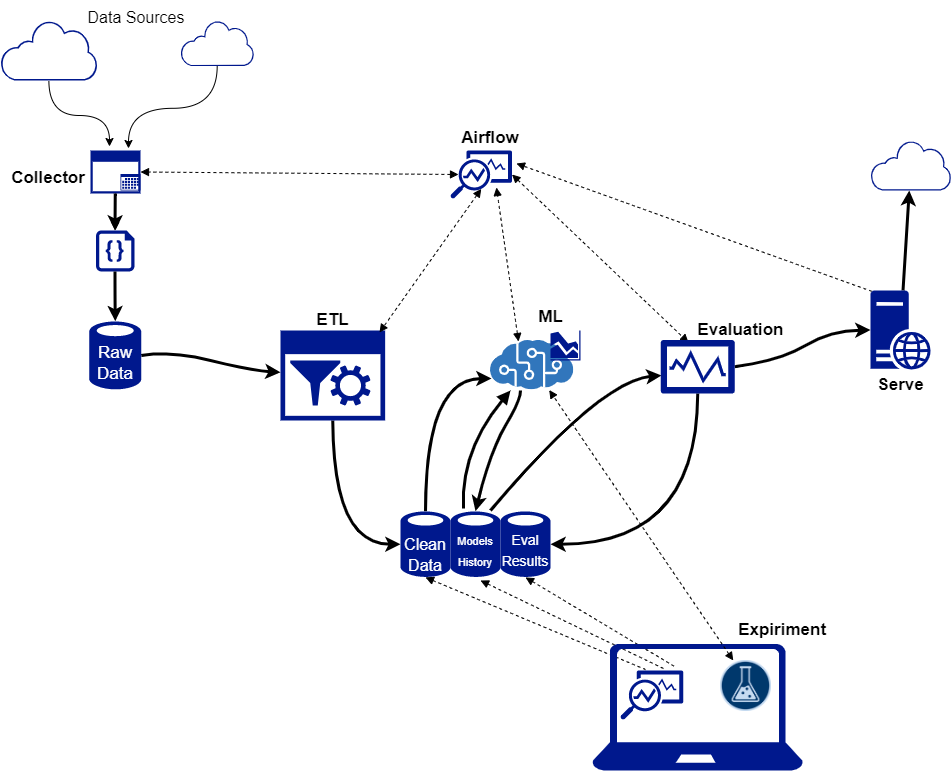

# System Architecture

The VisuWeigh system is designed to automatically collect data, clean data, train models, and evaluate models. If a model meets the criteria for production, it will automatically be pushed to the server where it can meet the demands of the cattle weighing user! All project tasks are monitored and scheduled with airflow. If there is a task failure, Airflow will send an email notification alert. 

## Data Collection

Data collection is performed from five cloud sources on a fixed schedule. The amount of raw data collected varies with each collection instance. Multiple instances of the collector can be run in parallel using multiple cores per instance. Multiple instances allow for collecting from multiple sources simultaneously. Multiple cores allow higher volumes of data to be processed without filling up large buffers. High processing power is required for the collector since it runs the YOLOV3 network on collected images for cow object detection. 

### Inputs
The data collector takes in a single argument which indicates the source of the data. 

### Outputs 
The collector outputs a json file that stores the records of each collected point. 
The json file contains the following record identifiers: 
[ lot, IMG_ID, Type, Shrink, Age, Avg_Weight, Tot_Weight, Hauled, Weaned, Feed, Health, Timestamp, prediction, auction] 

## Data Cleaning 
Various filters and algorithms are applied for the ETL(extract-transform-load) process. You can see this process in detail in the [data cleaning notebook.]()

### Input
The ETL task collects all the raw data files found in the database folder. [See Database Structure.](dbstruct) 

### Output

## Database Structure

A file system architecture was chosen for the database to keep the data broadly accessible for any method of extraction. 

The following outline shows the database structure for the entire 

